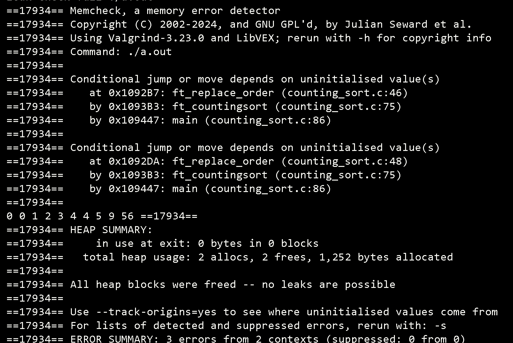

# Changes
Even the name is same but some process I've change it in final step which the original one would perform to iterate through soruce array and get the sums of position on the counting array but I'd rather not to sum the counting and just cpy by the n of that index into the source.
## Note!
Due to my poor writing the function perform in some general cases but still got some error about the conditional jump from checking with valgrind.
